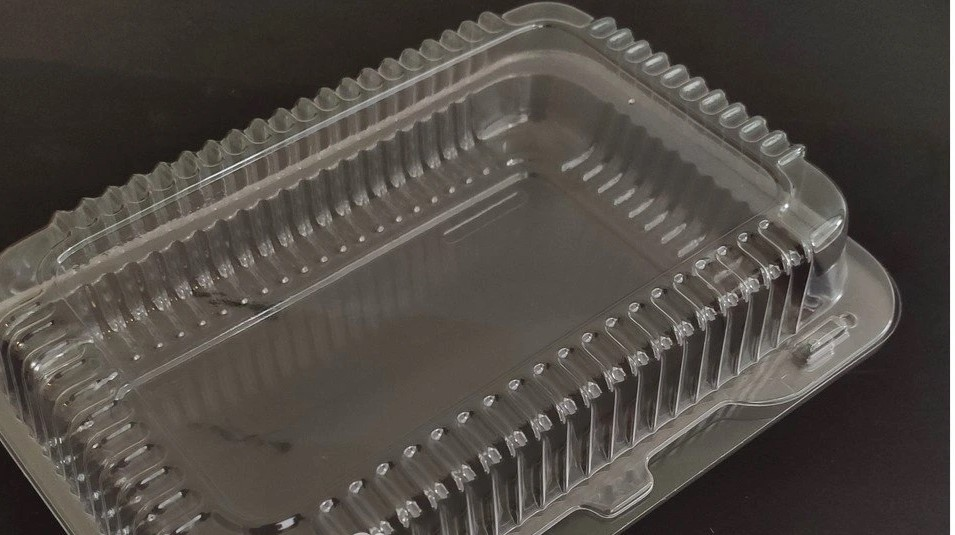

# Hardvérový ovládač hlasitostí jednotlivých aplikácií bežiacich na PC

## Obsah

- [Softvér](#softvér)
- [3D tlač](#3d-tlač)
- [Zoznam súčiastok](#zoznam-súčiastok)
- [Zapojenie](#zapojenie)
- [Zloženie](#zloženie)
- [Výsledok](#výsledok)

## Softvér

- [Arduino kód](arduino/README.md)
- [Softvér na Windows](windows/README.md)
- [Softvér na Linux](linux/README.md)
- [GUI](gui/README.md)

## 3D tlač

Treba vytlačiť:
- krabičku ([controller_case](3d_models/controller_case.stl))
- predný panel ([controller_front_panel](3d_models/controller_front_panel.stl))
- zadné krytky na ledky (6x) ([led_cover](3d_models/led_cover.stl))
- všetky súbory logo_*.stl (odporúčam tlačiť na veľmi pomalej rýchlosti, cca 10mm/s)
- držiak na Arduino ([nano_holder_v2](3d_models/nano_holder_v2.stl))

Držiak na Arduino Nano pochádza z [Thingiverse](https://www.thingiverse.com/thing:596400).

## Zoznam súčiastok

Všetky súčiastky som kupoval v internetovom obchode [Techfun.sk](https://techfun.sk/).

Zoznam:
- Arduino Nano (zvolil som verziu s USB-C konektorom)
- lineárny potenciometer 10K (6 kusov)
- TTP223 kapacitné dotykové tlačidlo (6 kusov)
- WS2812B led pásik (potrebných len 6 kusov LED, ale najmenšia možná dĺžka, ktorá sa dá kúpiť je 1m, zvolil som variantu 60 led/meter, nevodotesný)
- elektrolitický kondenzátor 330µF 16V (1 kus)
- rezistor 330Ω
- female piny
- krytky na potenciometre
- kábliky
- zmršťovacie trubice (na ochranu spojov)

Ďalšie potrebné veci:
- lepidlo (využíval som hlavne lepiacu pištoľ a sekundové lepidlo)
- skrutky 2.5x8mm (4 kusy) (dĺžka nemusí byť presne 8mm, najdlhšie však 20mm)
- skrutky 2.75x5mm (2 kusy) (na uchytenie Arduino držiaka do krabičky)
- obyčajný papier
- tenký priehľadný plastový obal z produktov (viď obrázok)

Arduino Nano:

Potenciometer s krytkou:

Kapacitné dotykové tlačidlo TTP223:

LED pásik WS2812B:

Female piny:

Plastový obal (príklad):

## Zapojenie

> [!IMPORTANT]
> [Schéma zapojenia](schematic.pdf)

Potenciometre sú zapojené nasledovne: krajné piny sú pripojené na +5V a GND, stredné piny (výstupy) sú pripojené k Arduino analógovým pinom A2-A7. Pri pohľade na potenciometer spredu s pinmi dolu je potrebné na ľavý pin pripojiť GND a na pravý +5V, čo bude mať za následok, že pri úplnom otočení potenciometra vľavo (proti smeru hodinových ručiciek) bude na výstupe 0V. Pri opačnom zapojení +5V a GND a úplnom ľavom otočení by bolo na výstupe 5V, čo by sa však dalo napraviť v softvéri.

Tlačidlá TTP223 sa pripájajú na +5V, GND a ich výstup označený ako 'I/O' sa pripája k Arduinu na digitálne piny podľa schémy.

Pred prvú ledku sa na DIN pripája 330Ω rezistor, je to odporúčanie výrobcu.

## Zloženie

Všetky logá treba nalepiť na kúsok priehľadného plastu, vystrihnutého presne na rozmery priestoru, kam sa vkladá ledka. Tento plast treba následne prilepiť a prekryť kúskom papiera taktiež vystrihnutého na správne rozmery  a prilepiť.
Led pásik treba postrihať na samostatné ledky, ktoré treba nalepiť na led krytku ([led_cover](3d_models/led_cover.stl)). Krytky je následne potrebné prilepiť o predný panel, stačí lepiacou páskou kvôli rozoberateľnosti.

## Výsledok

