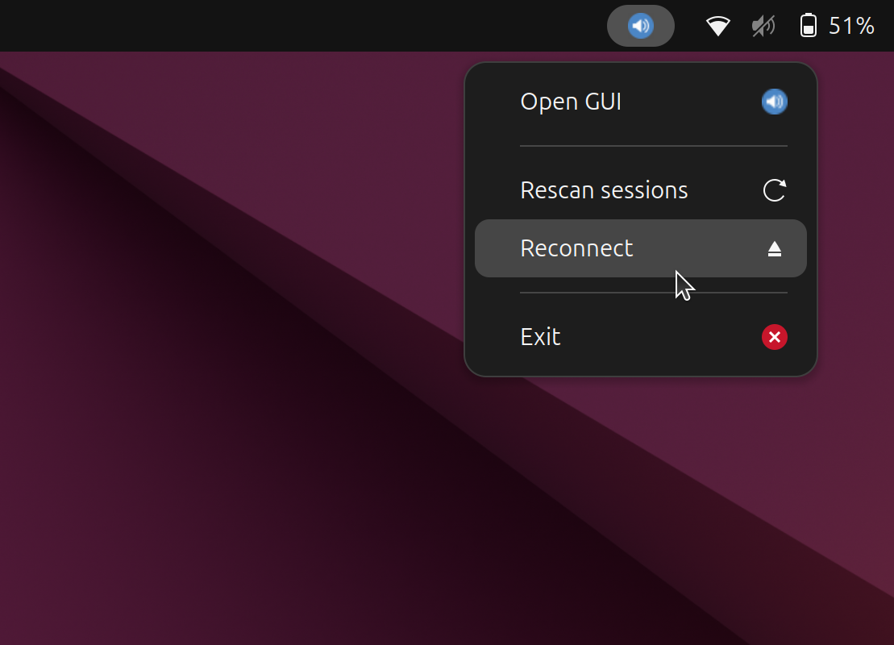

# Code for Linux

## Obsah

- [Kompilácia](#kompilácia)
- [Informácie](#informácie)
- [Odinštalovanie](#odinštalovanie)
- [Third-Party Libraries](#third-party-libraries)


## Kompilácia

Inštalácia potrebných knižníc:

    sudo apt install build-essential libpulse-dev libudev-dev

V priečinku **linux** stačí spustiť:

    make
    chmod +x ./install.sh
    ./install.sh

Ak Váš systém používa niektorú s nasledovných knižníc, môžete ešte skompilovať dynamickú knižnicu, ktorá umožní programu zobrazovať ikonu v system-tray:

---

- ***libayatana-appindicator3-1***

---

    sudo apt install libayatana-appindicator3-dev
    make ayatana-appind_lib
    systemctl --user stop volume_controller.service
    ./install.sh

---

- ***Qt framework***

---

    sudo apt install qtbase5-dev qtbase5-dev-tools
    make qt-appind_lib
    systemctl --user stop volume_controller.service
    ./install.sh


## Informácie

> [!IMPORTANT]
> Váš používateľ musí byť členom skupiny ***dialout***, aby mohol program korektne pristupovať k sériovému portu a komunikovať s Arduinom.
> Ak výstup príkazu ```groups``` neobsahuje ***dialout***, do skupiny sa pridáte nasledovne: ```sudo usermod -a -G dialout $USER```

Po vykonaní skriptu **install.sh** sa bude backendový program spúšťať automaticky pri spustení systému ako user-level systemd service. Je možné ho zastaviť príkazom 

    systemctl --user stop volume_controller.service
    
vypnúť príkazom 

    systemctl --user disable volume_controller.service
    
a opätovne spustiť príkazmi

    systemctl --user enable volume_controller.service
    systemctl --user start volume_controller.service


> [!IMPORTANT]
> GUI bolo testované na systéme s prostredím GNOME na Ubuntu.
> Aby sa GUI otvorilo kliknutím na **Open GUI** v ponuke system-tray ikony, je potrebné ho nainštalovať príkazmy v priečinku **gui**:
> 
> ```npm run package```
> 
> potom nastaviť skript ako spustiteľný:
> 
> ```chmod +x ./install-linux.sh```
> 
> a následne spustiť skript:
> 
> ```./install-linux.sh```
> 

Menu ikony v system-tray:


> [!NOTE]
> Prvé spustenie exportovaného GUI môže chvíľu trvať.

Pri prvom uložení nastavení sa vytvorí súbor config.json, do ktorého sa ukladajú všetky nastavenia.

## Odinštalovanie

V priečinku **gui**:
    
    chmod +x ./uninstall-linux.sh
    ./uninstall-linux.sh

V priečinku **linux**:

    chmod +x ./uninstall.sh
    ./uninstall.sh


## Third-Party Libraries

This project uses the following third-party libraries:

- [JSON for Modern C++](https://github.com/nlohmann/json) by Niels Lohmann, licensed under the [MIT License](LICENSE.nlohmann_json).