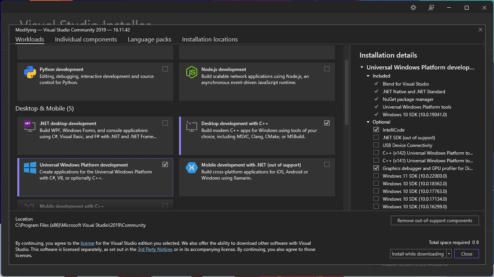
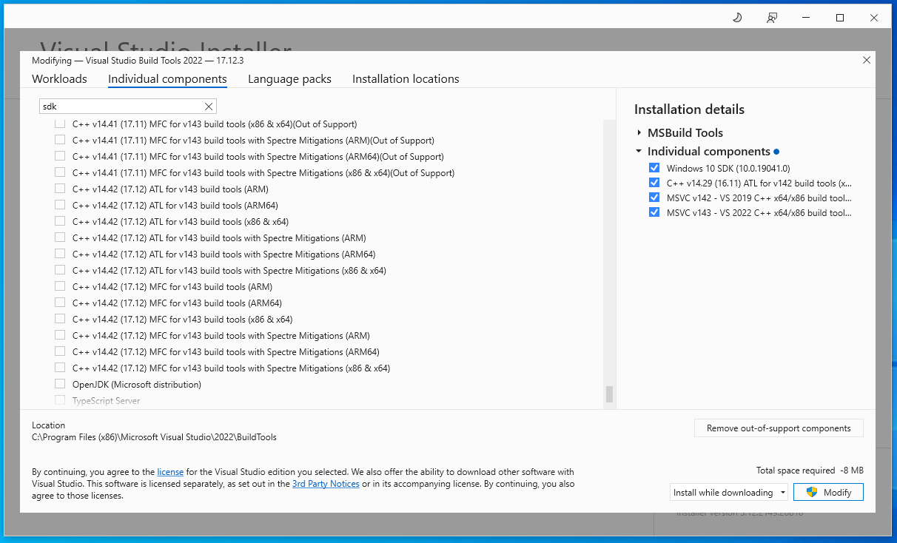

# Softvér na Windows

## Obsah

- [Informácie](#informácie)
- Kompilácia
    - [cez Visual Studio](#kompilácia-cez-visual-studio) (jednoduchšie, zaberá viac miesta)
    - [cez príkazový riadok](#kompilácia-cez-príkazový-riadok) (zložitejšie, menej miesta)
- [Third-Party Libraries](#third-party-libraries)

## Informácie

Program po spustení pridá na panel úloh ikonu, ktorá však po prvom spustení bude pravdepodobne skrytá. Môžete ju presunúť nižšie, aby bola počas behu programu viditeľná. Ľavým kliknutím na ňu sa otvorí GUI. Pravým kliknutím sa otvorí kontextové menu.

> [!IMPORTANT]
> aby sa GUI otvorilo kliknutím na ikonu, je potrebné ho najprv exportovať príkazom:
> 
> ```npm run package```
> 
> a následne prekopírovať vytvorený priečinok **volumecontroller-gui-win32-x64** do priečinka, ktorý obsahuje backendový program (.exe súbor)

> [!NOTE]
> Prvé spustenie exportovaného GUI môže chvíľu trvať.

Samotné spustenie GUI nevyžaduje, aby bolo exportované, stačí použiť príkaz ```npm run run```.

Pri prvom uložení nastavení sa vytvorí súbor config.json, do ktorého sa ukladajú všetky nastavenia.

## Kompilácia cez Visual Studio

Táto možnosť je jednoduchšia, avšak inštalácia programu Visual Studio môže zeberať príliš veľa miesta.

Priečinok [VolumeControllerWindows](VolumeControllerWindows/) je celý Solution, ktorý sa dá otvoriť v programe Microsoft Visual Studio. Je potrebné si ho stiahnuť a nainštalovať. Pri inštalovaní je potrebné zvoliť si nasledujúce workloads: Desktop development with C++ a Universal Windows Platform development.
 

Následne už len stačí importovať solution a spustiť.

## Kompilácia cez príkazový riadok

V tejto možnosti nie je potrebné inštalovať Visual Studio IDE, iba nástroje a knižnice od Microsoftu na kompiláciu programu.

Zo [stránky Microsoftu](https://visualstudio.microsoft.com/downloads/) je potrebné zo sekcie Tools for Visual Studio stiahnuť a nainštalovať Build Tools for Visual Studio 2022. [priamy odkaz na stiahnutie tu](https://aka.ms/vs/17/release/vs_BuildTools.exe)

Otvoríme Visual Studio Installer, klikneme na Modify, potom na kartu Individual components a označíme nasledovné položky:

 - MSVC v143 - VS 2022 C++ x64/x86 build tools (Latest)
 - MSVC v142 - VS 2019 C++ x64/x86 build tools (v14.29-16.11)
 - C++ v14.29 (16.11) ATL for v142 build tools (x86 & x64)
 - Windows 10 SDK (10.0.19041.0)
 
 

 Po inštalácii spustíme **x64 Native Tools Command Prompt for VS 2022**, a príkazom **cd** sa presunieme do priečinka VolumeControllerWindows. Na kompiláciu použijeme nasledovný príkaz:

```msbuild VolumeControllerWindows.sln /p:configuration=Release /p:platform=x64```

Skompilovaný program sa uloží do adresára x64/Release/


## Third-Party Libraries
This project uses the following third-party libraries:

- [JSON for Modern C++](https://github.com/nlohmann/json) by Niels Lohmann, licensed under the [MIT License](LICENSE.nlohmann_json).